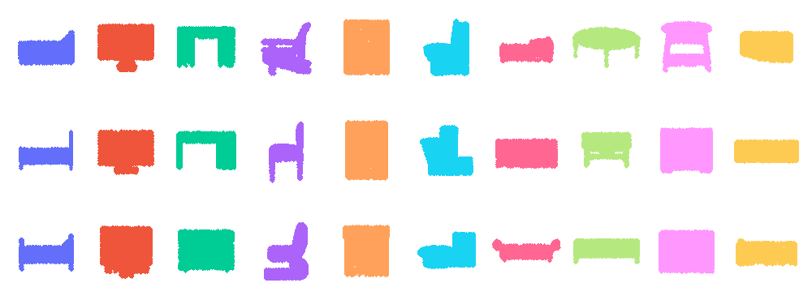
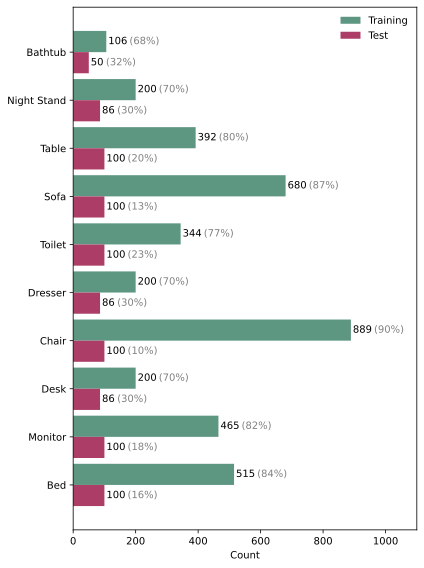
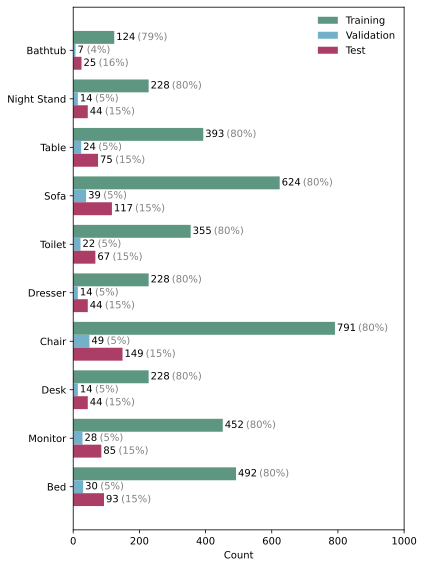
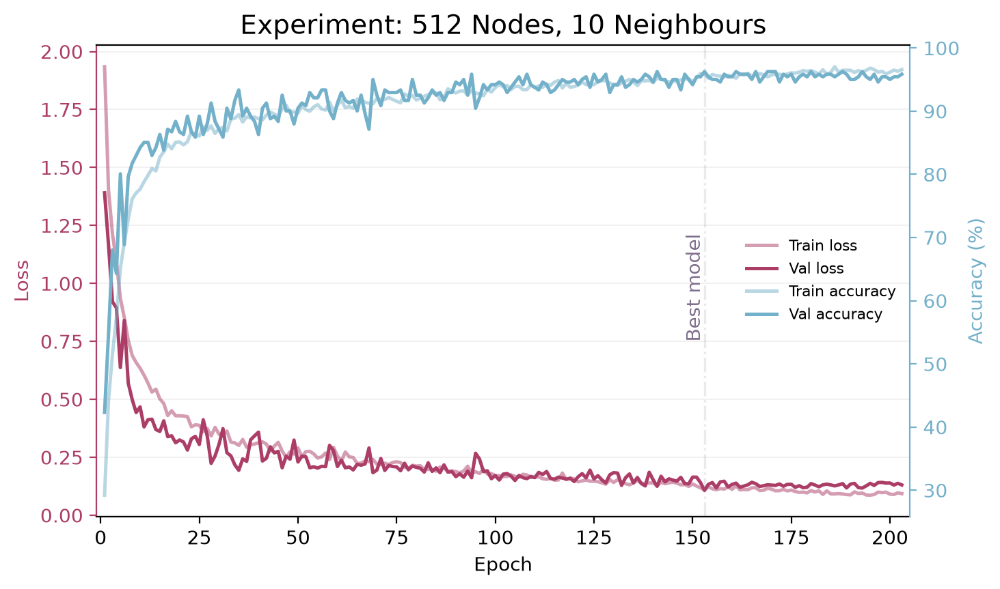
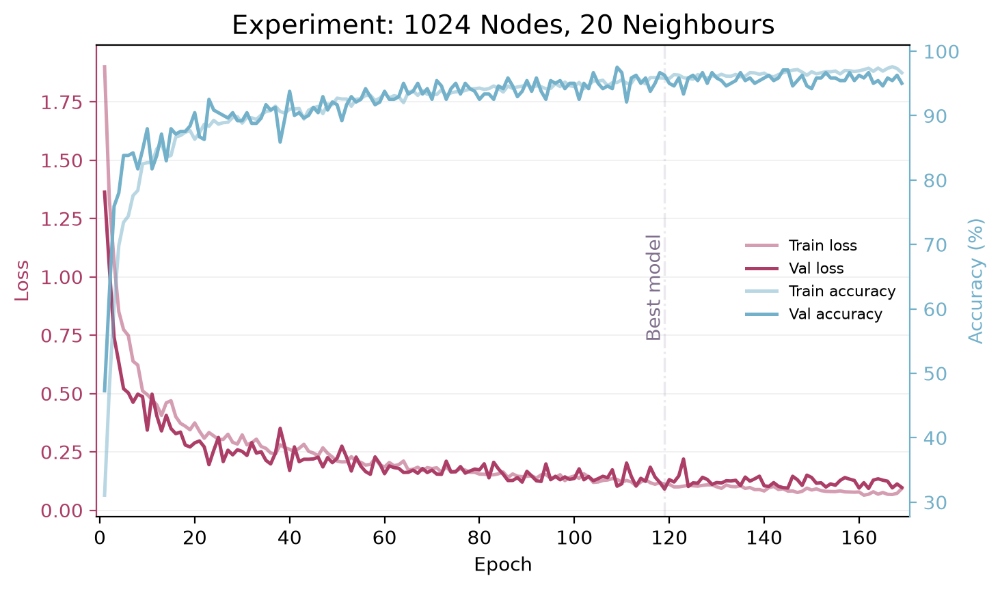
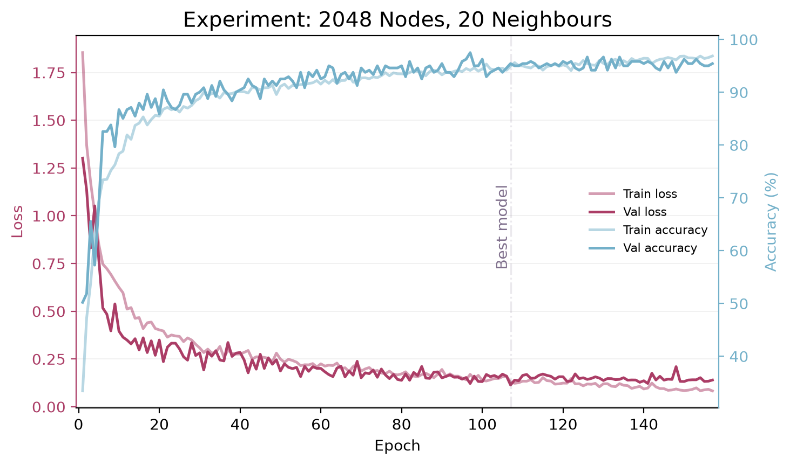
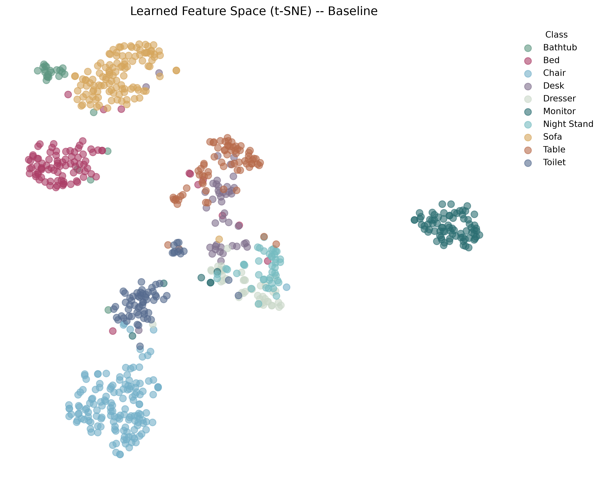
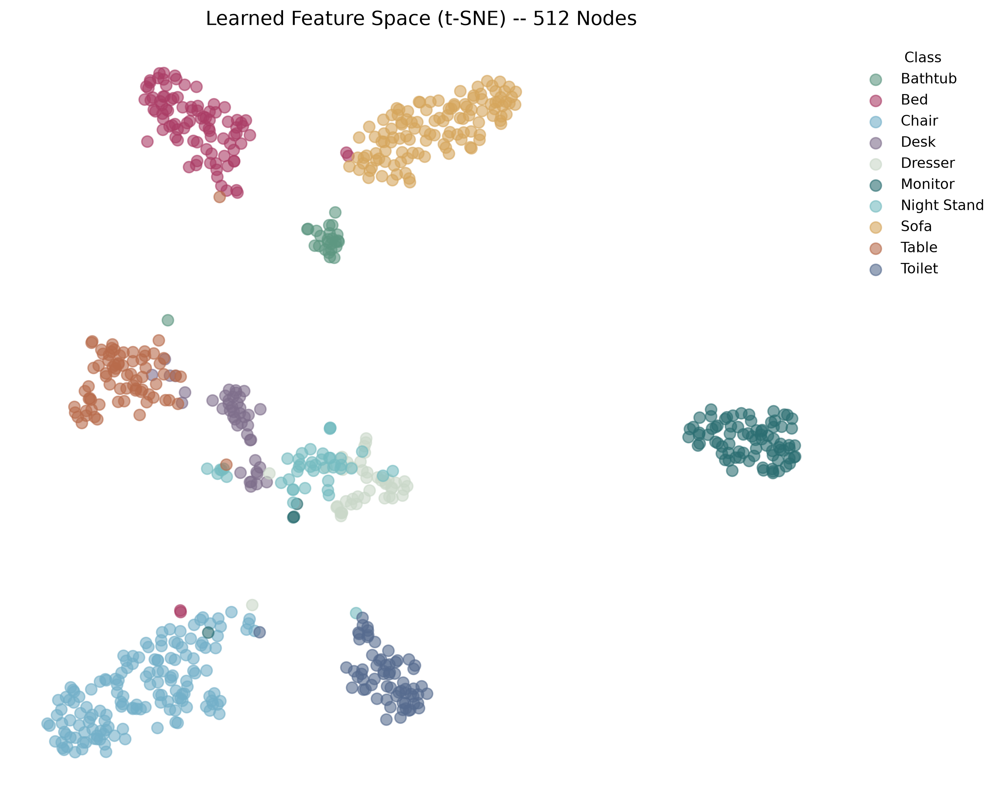
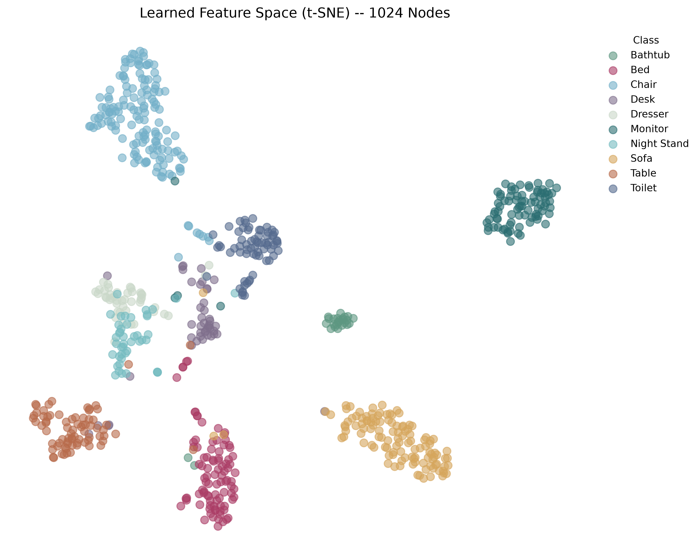
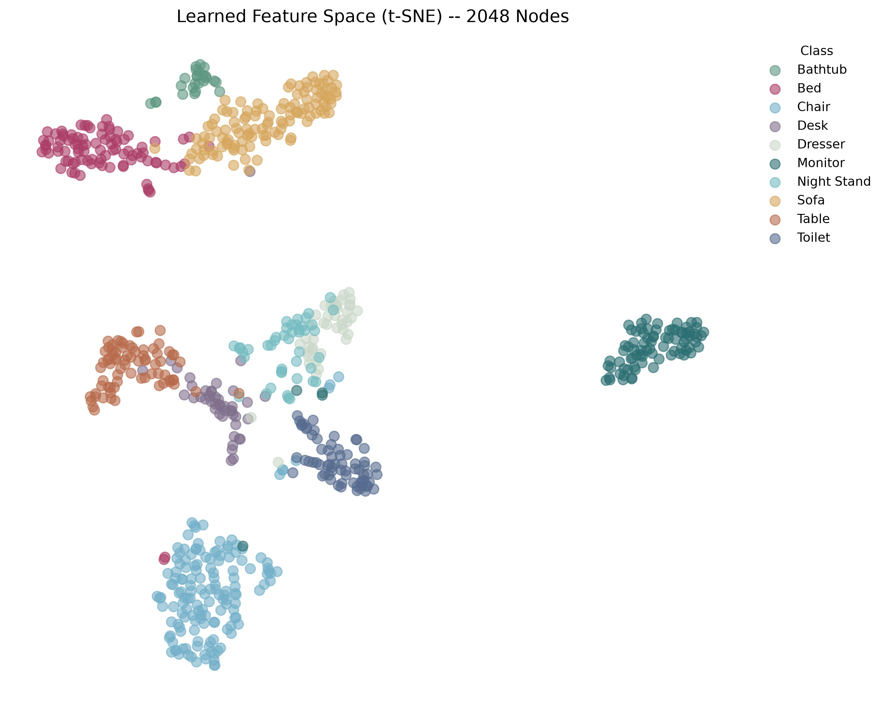

  

This repository contains my implementation of the [Dynamic Graph Convolutional Neural Network (DGCNN)](https://arxiv.org/pdf/1801.07829) for 3D object classification on the `ModelNet10` dataset. It provides a modern, PyTorch Geometric–based implementation that others can easily extend for their own projects. Reproducing existing graph deep learning techniques in this way was instrumental in developing my new architecture, **TopoLineArt** (publication forthcoming).

**Note:** LLM tools are helpful at checking the code and catching some bugs, however, in my research, I could not replace having an understanding of the methods that I use with having an LLM writing the code for me. I find this is the case often when I do something creative, something that requires an interaction with the real world.

----
# Code Overview
The code contains an implementation of a simplified `PointNet` baseline and a custom implementation of `DGCNN` using `PyTorch Geometric`. Following the methodology of the original paper, I conducted several experiments varying the numbers of sampled points and edges. The three primary configurations are:
1. 512 nodes and 10 edges
2. 1024 nodes and 20 edges
3. 2048 nodes and 20 edges (Note: The original paper used 40 edges, but this was scaled down to 20 to accommodate computational limits).

# Data
The official [ModelNet10 dataset](https://modelnet.cs.princeton.edu/) contains 10 classes of 3D objects: bathtub, bed, chair, desk, dresser, monitor, night stand, sofa, table, and toilet. 

Out of the box, the dataset is divided into training and testing sets. However, the default splits are not evenly distributed across classes (see the right-hand figure below). To address this, I merged all shapes and re-stratified them into a balanced train/validation/test split of 80% / 5% / 15%. The left bar plot illustrates the updated distribution. Stratifying the data in this manner is a better practice than relying on the unbalanced default splits, as it prevents the model from disproportionately misrepresenting certain classes.

  
  

# Results
| Model                         | Overall Accuracy | Mean Class Accuracy | Macro-Averaged Precision | Macro-Averaged F1 | Support-Weighted F1 |
|-------------------------------|-----------------:|--------------------:|-------------------------:|------------------:|--------------------:|
| Baseline                      |              92% |                 89% |                      90% |               89% |                 92% |
| **DGCNN 512 Nodes, 10 Edges** |          **96%** |             **94%** |                  **95%** |           **94%** |             **96%** |
| DGCNN 1024 Nodes, 20 Edges    |              95% |                 92% |                      94% |               93% |                 95% |
| DGCNN 2048 Nodes, 20 Edges    |              91% |                 90% |                      89% |               89% |                 91% |

The table above summarises the experimental results. The **DGCNN with 512 nodes and 10 edges** achieved the highest performance across all metrics. Interestingly, and contrary to the findings in the original DGCNN paper, increasing the number of sampled points (nodes) did not improve model performance. The training histories, showing loss and accuracy for both training and validation sets across the three experiments, are displayed below from left to right.

[//]: # (### Metric Definitions)

[//]: # ()
[//]: # (* **Overall Accuracy**: Proportion of all test samples that are classified correctly.)

[//]: # ()
[//]: # (* **Mean Class Accuracy**: Average classification accuracy across all classes, giving each class equal importance regardless of its number of samples.)

[//]: # ()
[//]: # (* **Macro-Averaged Precision**: Arithmetic mean of the precision calculated independently for each class. Each class contributes equally to the final value.)

[//]: # ()
[//]: # (* **Macro-Averaged F1**: Arithmetic mean of the per-class F1 values. It balances precision and recall while giving every class equal weight.)

[//]: # ()
[//]: # (* **Support-Weighted F1**: Average of the per-class F1 values weighted by the number of samples belonging to each class. Classes with more samples therefore have a larger influence on the final value.)

  
  
  

For an extra layer of interpretability and analysis of the model's peformance, t-SNE was utilised to visualise the embeddings of the models. In all experiements we see that classes were clustred correctly (see the main article for an interactive version of these figures).

  
  
   
  
  

# Conclusion & Reflection

The reimplementation of the DGCNN architecture using `PyTorch Geometric` successfully reproduced the general efficacy of the original paper, achieving a peak overall accuracy of 96%. 

A key observation from these experiments is that increasing the number of sampled points does not necessarily yield better performance. This contradiction with the original paper likely stems from the difference in dataset, mainly, the number of classes. `ModelNet10` contains 10 broad classes, whereas the original authors evaluated their model on `ModelNet40`. I hypothesise that for simpler classification tasks, 512 points perfectly capture the macroscopic geometric features required. Introducing more nodes simply adds redundant points along flat surfaces. Furthermore, because this implementation utilises `global_mean_pool` to aggregate data from the `EdgeConv` layers, this redundant information actively dilutes the network's strongest feature activations, leading to a drop in overall performance.

Additionally, the high performance can be partially attributed to the custom data splitting strategy. The official `ModelNet10` train and test splits contain inherent class imbalances. By pooling the entire dataset and re-stratifying it into a balanced 80/5/15 split, the distribution shift between training and testing data was eliminated. While this makes direct comparison to the original paper's benchmark metrics difficult, it ultimately allowed the model to train more equitably across all classes and achieve higher Macro-Averaged F1 scores.

----

You can read the full article here:

-----
# References

- Wang, Y., Sun, Y., Liu, Z., Sarma, S. E., Bronstein, M. M., & Solomon, J. M. (2019). Dynamic Graph CNN for Learning on Point Clouds. *ACM Transactions on Graphics (TOG)*, 38(5), 1–12.

Steps:
- [ ] Download the data
- [ ] Open the data files and plot the distributions to make sure classes are balanced.
- [ ] Show a grid of 4x4 3D objects for each class
- [ ] Cluster them using k-nearest neighbour (and make a visualisation of the 10 classes clustered with hovering feature where hovering over a datapoint shows a sample) —> the visualisation should be for the training split.
- [ ] Build a simple classification model
- [ ] Understand and explain the model’s predictions using SHAP
- [ ] Reproduce a classification paper. Then compare it scientifically to the baseline above.
- [ ] Build a simple wGAN model to generate 3D shapes.

Download dataset at: https://3dvision.princeton.edu/projects/2014/3DShapeNets/ModelNet10.zip
Read about the dataset and see code examples at: https://www.kaggle.com/datasets/balraj98/modelnet10-princeton-3d-object-dataset/data
The dataset page:https://modelnet.cs.princeton.edu/
The paper to cite about this dataset: https://3dvision.princeton.edu/projects/2014/3DShapeNets/paper.pdf

Read about [Object File Format `.off`](https://segeval.cs.princeton.edu/public/off_format.html)# Point-Cloud-Classification
